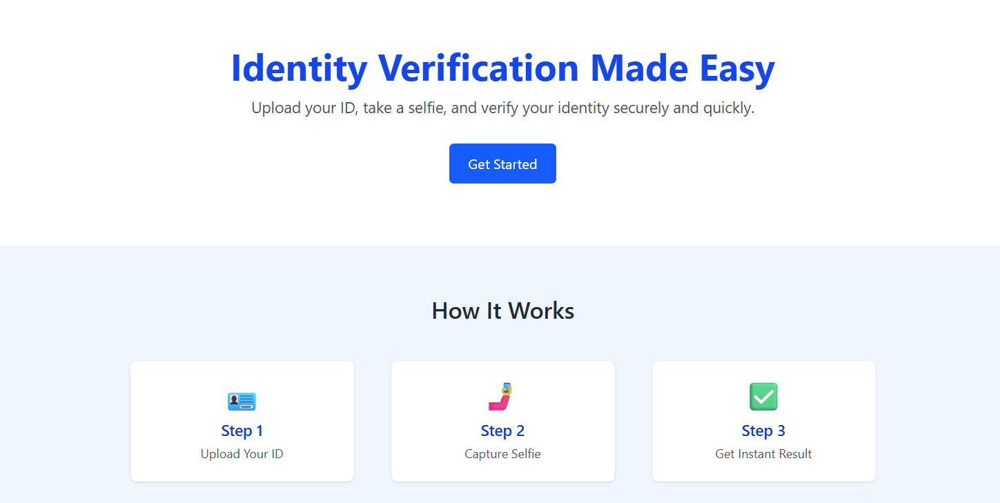
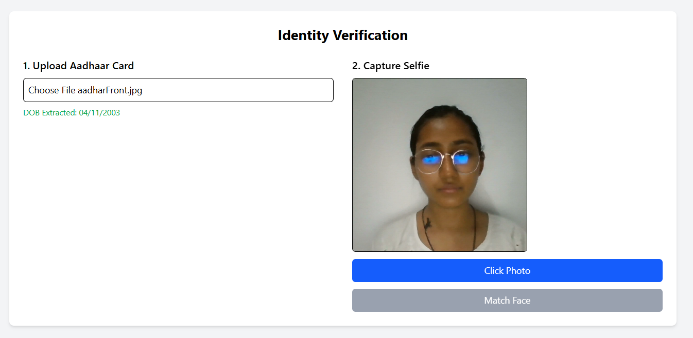
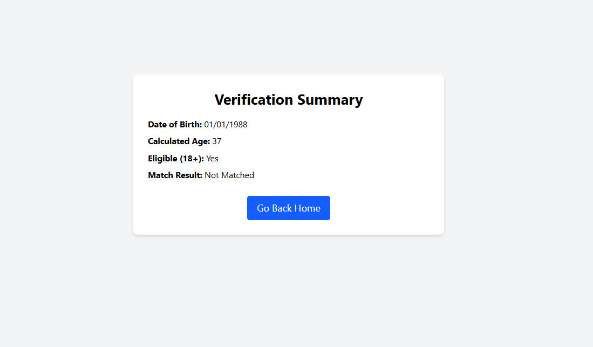

# 🔍 Age & Identity Verification System (Proof of Concept)

This web-based system simulates government ID verification by extracting age and photo from a sample Aadhar card, comparing it to a live selfie, and determining if the person is above a certain age threshold (e.g., 18+). It uses OCR and facial recognition techniques to demonstrate the concept.

---

## 📌 Problem Statement

### Title:
**Build an Age & Identity Verification System Using Simulated Government ID Cards**

### Objective:
Design a system that can:
1. Extract **Date of Birth (DOB)** and **photo** from a simulated identity document (currently Aadhar).
2. Capture a **live selfie** via the browser.
3. Determine whether:
   - The selfie and ID photo belong to the same individual.
   - The person meets a minimum age requirement (e.g., 18+).

---

## 🧱 Architecture Overview

- **OCR**: Tesseract (via Node js) for extracting DOB and text from Aadhar image.
- **Face Matching**: OpenCV  used to compare ID photo and selfie.
- **Frontend**: React (located in `/frontend/zynga_frontend`) for document upload and selfie capture.
- **Backend**: Node.js & Express (`/backend`) for API handling and result serving.
- **Python Backend**: Flask app (`/python_backend`) to run OCR and facial comparison logic.

---

## 🚀 Features

- ✅ Upload simulated Aadhar card (image or PDF)
- ✅ Extract photo and DOB using OCR
- ✅ Capture selfie using webcam
- ✅ Compare ID photo with selfie using facial embeddings
- ✅ Age verification (e.g., 18+)
- ✅ Confidence score display (e.g., 87% match)
- ✅ Feedback for blurry/poor lighting images (basic)

---

## 💡 Bonus Capabilities

- 🌐 Multi-language support for OCR 
- 📊 Displays numerical verification score
- 💬 Alerts for poor image quality or lighting conditions
- Included an executable binary for ease of testing and execution

---

## 🛠 Setup Instructions

Project: Zynga Hackathon Setup Guide

folders:
  - backend
  - frontend/zynga_frontend
  - python_backend
  - screenshots

setup:
  frontend:
    path: frontend/zynga_frontend
    install_command: |
      bash
      cd frontend/zynga_frontend
      npm install
    start_command: |
      bash
      npm run dev
    port: 5173

  backend:
    path: backend
    install_command: |
      bash
      cd backend
      npm install
    start_command: |
      bash
      npx nodemon server.js
    port: 4000

  python_backend:
    path: python_backend
    install_command: |
      bash
      cd python_backend
      pip install -r requirements.txt
    start_command: |
      bash
      python app.py
    port: 5000

execution:
  steps:
    - description: Clone the repository
      command: |
        bash
        git clone https://github.com/Deepika8383/Zynga_hackthon.git
        cd Zynga_hackthon

    - description: Install frontend dependencies
      command: |
        bash
        cd frontend/zynga_frontend
        npm install

    - description: Install backend dependencies
      command: |
        bash
        cd backend
        npm install

    - description: Install Python backend dependencies
      command: |
        bash
        cd python_backend
        pip install -r requirements.txt

    - description: Start frontend
      command: |
        bash
        cd frontend/zynga_frontend
        npm run dev

    - description: Start backend
      command: |
        bash
        cd backend
        npx nodemon server.js

    - description: Start Python backend
      command: |
        bash
        cd python_backend
        python app.py

access:
  url: http://localhost:5173
  description: Access the app in your browser after all three servers are running.

  
## 🚀 Binary Executables

Pre-built binary/executable files are available for each component of the project:

- **Frontend**: Production build available in `frontend/zynga_frontend/dist/` folder.
- **Node.js Backend**: Binary file present as `backend/node-backend`.
- **Python Backend**: Binary executable file present as `python_backend/app.exe`.

No need to build from source — you can directly use these executables for quick testing and deployment.

troubleshooting:
  - tip: Ensure ports 5173, 4000, and 5000 are available.
  - tip: Make sure C++ build tools are installed and available in PATH.
  - tip: If pip install fails, use virtualenv:
      command: |
        ```bash
        python -m venv venv
        # Activate on macOS/Linux:
        source venv/bin/activate
        # Or on Windows:
        venv\Scripts\activate
        pip install -r requirements.txt
        ```
## 🖼 Screenshots

### 🔹 Home Page


### 🔹 Verification Page


### 🔹 Result Page


---

## 🎥 Demo Video

[Watch the Demo Video]([https://your-demo-video-link.com]([https://drive.google.com/drive/my-drive](https://drive.google.com/file/d/1IlNp3fRZb5RXp2AsvcH9XOQwraFuF_Wh/view?usp=sharing)))


notes:
  - This is a proof-of-concept. Do not use with real personal data.
  - No UIDAI or real government APIs are involved.
  - Use only simulated/fake Aadhaar cards for testing purposes.
